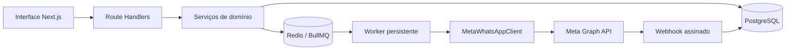

# Arquitetura

## Limites

O sistema é single-tenant. Existe um único proprietário autenticado, mas registros mantêm `user_id` para separar propriedade e permitir evolução futura sem implementar um SaaS multiusuário agora.

### Trust boundaries

- Navegador → API: sessão HTTP-only, validação Zod e verificação de origem em mutações.
- Arquivo importado → domínio: conteúdo não confiável, limitado a 10 MB e validado antes da persistência.
- Worker → Meta: token acessível somente no backend; logs redigem segredos.
- Meta → webhook: assinatura `X-Hub-Signature-256` validada sobre o corpo bruto.
- Redis → worker: cada job referencia IDs internos; o worker recarrega o estado autoritativo do banco.

## Idempotência

`CampaignRecipient` possui unicidade `(campaign_id, contact_id)` e `idempotency_key`. O mesmo valor é usado como `jobId` do BullMQ. O worker recusa estados terminais e só assume destinatários elegíveis por atualização condicional. Eventos de webhook usam SHA-256 do corpo como chave idempotente e `provider_message_id` é único.

A API da Meta não oferece uma chave geral de idempotência para o endpoint de mensagens. Existe uma janela residual caso o processo caia depois da aceitação da Meta e antes de persistir o `wamid`. O projeto reduz a janela com estado `PROCESSING`; não afirma garantia impossível de exactly-once sobre uma API externa sem consulta transacional.

## Execução e falhas

- Next.js: interface, autenticação, APIs e webhook.
- PostgreSQL: fonte de verdade.
- Redis/BullMQ: agendamento, concorrência e retry.
- Worker: processo persistente com limite por segundo e concorrência configuráveis.
- Um `200` de envio significa aceitação, não entrega.
- `SENT`, `DELIVERED`, `READ` e `FAILED` são consolidados por webhook.
- Retry ocorre somente em timeout, `429`, `5xx` e códigos temporários conhecidos, limitado a três tentativas.
- Campanha pausada não processa novos envios; cancelar afeta somente destinatários ainda não enviados.
